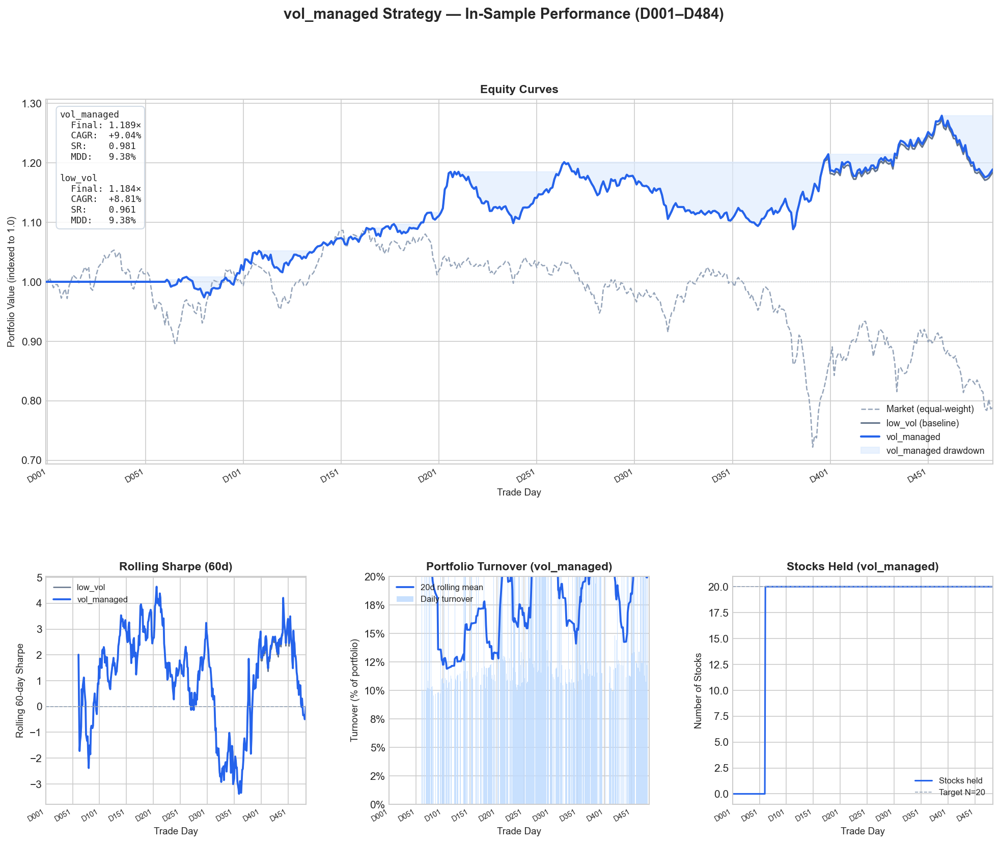

# Mini Course: How We Built a Trading Strategy

A five-article series explaining what we're doing in the Feishu/Lark Quant Competition — written for anyone curious, no finance background required.

---

## Articles

| # | Title | What you'll learn |
|---|-------|------------------|
| 1 | [What Is the Stock Market, Really?](01-what-is-the-stock-market.md) | Shares, prices, OHLCV data, the order book |
| 2 | [The Alpha Hunt](02-the-alpha-hunt.md) | What quants do, IC explained, the competition rules |
| 3 | [The Signals We Built](03-signals-we-built.md) | 10+ strategies from academic papers, and what the data said |
| 4 | [When Smart Strategies Fail](04-when-smart-strategies-fail.md) | IR 9.64 → CAGR −54%: the execution gap that broke everything |
| 5 | [What Actually Works](05-what-actually-works.md) | The boring strategy that beat a falling market by 27 points |

---

## The Story in One Paragraph

We built thirteen quantitative trading signals grounded in academic research — reversal signals, order book signals, momentum filters — and combined them into a composite with an Information Ratio of 9.64. When we ran a realistic portfolio backtest simulating actual trade prices, the composite lost 54% while the market fell 18%. The culprit: the reversal alpha (the price snap-back we were predicting) happens overnight before the market opens, after which we were forced to buy. The one signal that survived was minimum volatility — selecting the calmest, most boring stocks — which returned +9% in the same period. A volatility-managed overlay (hold the portfolio on turbulent days rather than rebalancing) pushed it to +9.04% with a Sharpe ratio of 0.981. That's what we're submitting.

---

## Strategy Dashboard

The chart below shows the in-sample equity curve, rolling Sharpe ratio, daily turnover, and portfolio size for the submitted `vol_managed` strategy (D001–D484):

*Top-left: equity curve vs. market. Top-right: 20-day rolling Sharpe ratio. Bottom-left: daily turnover (% of portfolio replaced). Bottom-right: number of holdings per day.*

---

## Key Numbers

| | Value |
|---|---|
| Strategy | Minimum volatility + vol-managed overlay |
| In-sample period | 484 trading days, 2,270 stocks |
| Portfolio size | 20 stocks |
| CAGR (in-sample) | +9.04% |
| Sharpe ratio | 0.981 |
| Max drawdown | 9.38% |
| Market return (same period) | ≈ −18% |
| Average daily turnover | ~4.3% |
| Effective independent bets | ~7 |
